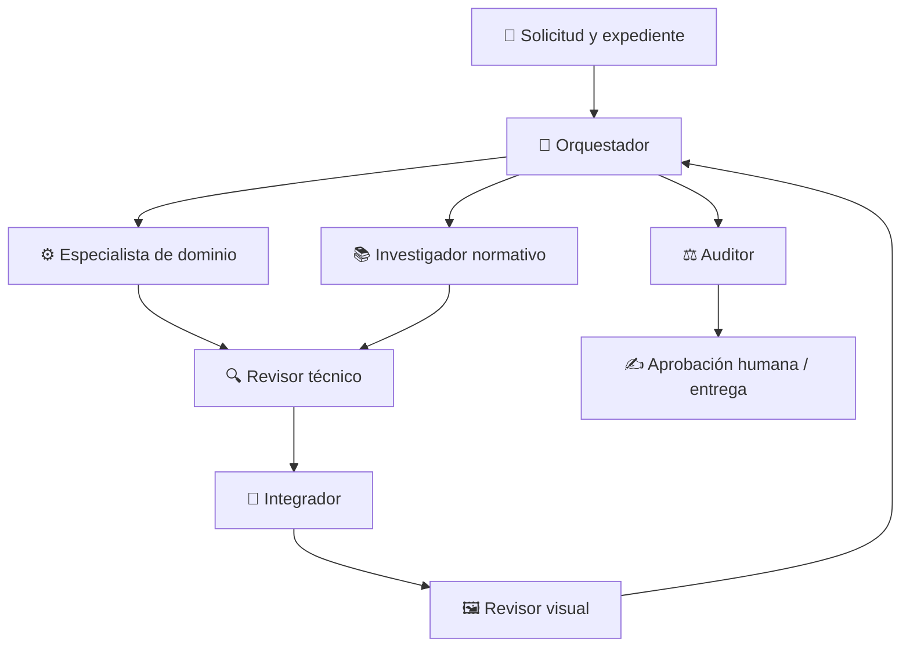

# 🧭 Ariel Agent OS

> Un sistema portable de agentes para convertir expedientes técnicos en trabajo trazable, revisable y humano-responsable.
>
> Este repositorio no es “un chatbot con muchos prompts”. Es el plano de una pequeña organización digital: cada rol sabe qué puede hacer, qué no puede decidir y cómo entregar su trabajo al siguiente.

## 🌱 La idea que dio origen al proyecto

Ariel Agent OS nace de una necesidad concreta: recibir una solicitud técnica —por correo, llamada, WhatsApp o expediente documental— y transformarla en un entregable serio sin perder control sobre datos, evidencia, criterios técnicos ni presentación final.

El primer piloto es un informe de verificación de sistemas de puesta a tierra (P.A.T.). Un ingeniero realiza mediciones en campo, registra una matriz de datos, toma fotografías y reúne documentos de referencia. El sistema debe ayudar a organizar el expediente, analizarlo con prudencia, investigar criterios aplicables, producir un borrador Word conforme a una plantilla y detectar errores que suelen pasar desapercibidos: una foto girada, una evidencia en orden incorrecto, una lectura sin respaldo o una conclusión que excede los datos.

Pero la ambición es mayor: construir una base reusable para análisis COMTRADE, protecciones, supervisión de obras, revisión de documentos, informes y otras actividades de ingeniería. La inteligencia del sistema no vive en una plataforma particular: vive aquí, en este repositorio. 🌍

> **Principio rector:** el arnés puede cambiar; la arquitectura, el método y la trazabilidad deben sobrevivir.

---

## 🚦 Estado actual: diseño estructurado / piloto controlado

| Componente | Estado | Qué significa |
|---|---:|---|
| Visión, arquitectura, gobernanza y glosario | 🟡 Draft | Definidos para el piloto; sujetos a ajuste por experiencia. |
| Roles lógicos | 🟡 Draft | Siete roles documentados con responsabilidades separadas. |
| Workflow de informe P.A.T. | 🟡 Draft | Secuencia y compuertas declaradas; aún no ejecutada contra un caso piloto. |
| Contratos de datos | 🟡 Draft | Estructuras de control ya redactadas. |
| Skill de dominio P.A.T. | 🟡 Draft | Método migrado y ampliado desde el Project inicial. |
| Skills transversales | 🟡 Draft | Procedimientos base redactados; faltan pruebas de aceptación. |
| Herramientas y adaptadores | ⚪ No enlazados | El catálogo existe, pero no hay conexiones concretas configuradas. |
| Emisión externa automática | 🔴 No permitida | Siempre requiere aprobación humana registrada. |

**Importante:** un estado **draft** no significa “terminado y listo para producción”. Significa “lo bastante definido para probarlo y aprender, sin fingir que ya es un sistema operativo maduro”.

---

## 🧠 La imagen mental correcta

Imagina una oficina técnica pequeña, disciplinada y con memoria perfecta:

- Un **orquestador** recibe la solicitud y entiende qué se pidió.
- Un **especialista de dominio** trabaja la ingeniería.
- Un **investigador normativo** verifica fuentes, ediciones y cláusulas.
- Un **revisor técnico** busca errores, saltos de lógica y conclusiones débiles.
- Un **integrador** arma el documento sin cambiar la ingeniería aprobada.
- Un **revisor visual** inspecciona el Word/PDF como lo haría una persona.
- Un **auditor** pregunta: “¿fue razonable aprobar, bloquear o escalar esto?”

No todos trabajan siempre. El orquestador activa solo los que el caso necesita, de forma secuencial o paralela. Por ejemplo, el análisis técnico y la investigación normativa pueden avanzar en paralelo cuando ya existe evidencia suficiente.

La entrega no es una línea recta ciega. Si algo falla, se corrige lo mínimo necesario, se preserva el trabajo válido y se vuelve a revisar.

---

## ✨ Principios que no se negocian

1. **Evidencia antes que apariencia.** Un Word bonito no convierte un dato incompleto en una conclusión válida.
2. **No inventar.** No se inventan valores, fechas, puntos, configuraciones, fotos, fuentes, criterios ni conclusiones.
3. **Trazabilidad completa.** Toda conclusión relevante debe poder recorrerse: medición o dato → evidencia → finding → criterio → recomendación → entregable.
4. **La campaña actual manda.** Una matriz, foto o nota de la revisión actual tiene prioridad sobre informes históricos. El histórico orienta; no prueba.
5. **Las normas no son decoración.** No se atribuyen límites genéricos a IEC, IEEE, ANSI, NFPA u otra fuente. Un criterio debe indicar documento, edición, cláusula o requisito y por qué aplica al caso.
6. **La duda se declara.** Si falta evidencia o el método no está sustentado, corresponde **Pendiente** o **No concluyente**, no una certeza simulada.
7. **La calidad visual también es calidad técnica.** Una fotografía girada, ilegible, duplicada o vinculada a la lectura equivocada puede invalidar la trazabilidad del informe.
8. **La persona conserva la última palabra.** Ningún agente emite externamente por sí solo. La aprobación humana es una compuerta, no una formalidad.

---

## 🗂️ Cómo está organizado el repositorio

    ariel-agent-os/
    ├── README.md                 ← Este mapa narrativo para humanos
    ├── AGENTS.md                 ← Reglas globales para agentes y arneses
    │
    ├── docs/                     ← La filosofía y las definiciones del sistema
    │   ├── vision.md
    │   ├── architecture.md
    │   ├── operating-model.md
    │   ├── governance.md
    │   ├── glossary.md
    │   ├── input-contract.md
    │   └── role-matrix.md
    │
    ├── contracts/                ← Formularios estructurados que evitan ambigüedad
    ├── registry/                 ← Índices de roles, skills, herramientas y workflows
    ├── agents/                   ← Mandato y límites de cada rol
    ├── skills/                   ← Métodos de dominio y capacidades reutilizables
    ├── workflows/                ← Secuencia de trabajo por tipo de tarea
    ├── adapters/                 ← Puentes a Codex, Claude Code u otros arneses
    ├── knowledge/                ← Conocimiento reusable autorizado
    └── evals/                    ← Casos de prueba y criterios de evaluación

### Dos archivos de raíz, dos propósitos

- **[README.md](README.md)** es para una persona: explica el proyecto, reconstruye su contexto y permite retomarlo meses después.
- **[AGENTS.md](AGENTS.md)** es para los agentes: indica cómo deben comportarse antes de tocar un caso o modificar la arquitectura.

---

## 👥 Los siete roles

| Rol | Su pregunta central | Puede hacer | No puede hacer |
|---|---|---|---|
| 🧭 Orquestador | “¿Qué pidió realmente el usuario y qué falta?” | Crear work items, seleccionar workflow, coordinar etapas, validar intención y DoD. | Inventar alcance ni aprobar técnicamente su propio trabajo. |
| ⚙️ Especialista de dominio | “¿Qué dicen los datos dentro del método técnico?” | Analizar evidencia y producir findings con limitaciones. | Autoaprobarse o emitir el informe. |
| 📚 Investigador normativo | “¿Cuál es el criterio exacto y aplica aquí?” | Verificar fuente, edición, cláusula y aplicabilidad. | Usar límites genéricos o suponer una norma. |
| 🔍 Revisor técnico | “¿La conclusión es correcta, trazable y prudente?” | Aprobar, pedir corrección o escalar. | Alterar silenciosamente el trabajo revisado. |
| 🧩 Integrador | “¿Cómo se unen las piezas aprobadas?” | Armar Word, tablas, galería y paquete de entrega. | Cambiar datos, findings o conclusiones aprobadas. |
| 🖼️ Revisor visual | “¿Se ve correcto al abrirlo como documento real?” | Revisar orientación, orden, cortes, pies, legibilidad y paginación. | Validar la ingeniería de una conclusión. |
| ⚖️ Auditor | “¿Fue razonable aprobar, bloquear o escalar?” | Evaluar la decisión y las compuertas de control. | Recalcular toda la ingeniería o sustituir aprobación humana. |

La matriz completa está en [docs/role-matrix.md](docs/role-matrix.md).

### Un segundo equipo: presentaciones

El piloto P.A.T. usa los siete roles de arriba tal cual. El dominio de presentaciones (workflow `presentation-deck`) reutiliza orquestador, integrador, revisor visual y auditor, pero sustituye especialista/investigador/revisor técnico por cuatro roles propios, porque construir un deck reparte trabajo entre disciplinas paralelas en vez de una sola cadena de análisis de evidencia:

| Rol | Su pregunta central | Puede hacer | No puede hacer |
|---|---|---|---|
| ✍️ Estratega de contenido | "¿Qué necesita saber esta audiencia, en qué orden?" | Estructurar narrativa y mensajes clave desde el contenido fuente. | Inventar cifras ni decidir el sistema visual. |
| 🎨 Diseñador visual | "¿Cómo se ve esta narrativa?" | Definir paleta, tipografía y arquetipos de slide. | Cambiar mensajes, datos o estructura narrativa. |
| 📣 Copywriter de marketing | "¿Este mensaje mueve a la audiencia a decidir?" | Afinar titulares, CTA y posicionamiento — solo si el propósito es persuasivo. | Inventar promesas o resultados no sustentados. |
| 🔍 Revisor de narrativa | "¿Esto es trazable, no redundante y ajustado a la audiencia?" | Aprobar, pedir corrección o rechazar afirmaciones sin respaldo. | Decidir el sistema visual ni la maquetación. |

Detalle completo, matriz de handoffs y razonamiento de por qué no se reusan los roles genéricos: [docs/role-matrix.md](docs/role-matrix.md#extensión--equipo-de-presentaciones-workflow-presentation-deck).

---

## 🧰 Skills: el conocimiento operativo

Una **skill** es un procedimiento reusable. Un rol asume responsabilidad y toma decisiones dentro de sus límites; una skill transforma, valida o recupera información.

### Skills de dominio: el conocimiento propio

Estas contienen la metodología y el criterio técnico particular de Ariel Agent OS.

- **[analyze-grounding-report](skills/analyze-grounding-report/SKILL.md)**  
  Analiza expedientes de verificación P.A.T. con evidencia de campaña, matriz, fotos, plantilla, histórico y criterios aplicables.
- **[critique-grounding-safety-analysis](skills/critique-grounding-safety-analysis/SKILL.md)**  
  Aplica criterio real de ingeniería eléctrica (IEEE/IEC) a un resultado P.A.T. — suficiencia del criterio, consistencia por activo, outliers, tendencia. La usan domain-specialist (al proponer), technical-reviewer (de forma independiente, antes de leer la propuesta) y auditor (para confirmar que las otras dos la usaron, sin rehacerla).
- **analyze-comtrade-event**  
  Registrada como futura. No se activa hasta que tenga su propio método, contratos y pruebas.
- **[design-presentation-narrative](skills/design-presentation-narrative/SKILL.md)**  
  Convierte un brief o contenido fuente en estructura de slides y mensajes clave trazables. La usa content-strategist.
- **[critique-presentation-effectiveness](skills/critique-presentation-effectiveness/SKILL.md)**  
  Aplica un rubric de efectividad (audiencia, un mensaje por slide, redundancia, trazabilidad de cifras) a una narrativa o borrador. La usan content-strategist (al proponer), narrative-reviewer (de forma independiente) y auditor (para confirmar que las otras dos la usaron).

### Skills transversales: piezas reutilizables

Estas no toman decisiones de ingeniería; dan soporte controlado a muchos dominios.

| Skill | Hace | No hace |
|---|---|---|
| [validate-spreadsheet-input](skills/validate-spreadsheet-input/SKILL.md) | Verifica estructura, unidades, celdas, duplicados y datos visibles. | Decidir aceptación técnica. |
| [manage-photo-evidence-gallery](skills/manage-photo-evidence-gallery/SKILL.md) | Ordena y controla evidencia fotográfica y orientación visible. | Inferir lecturas o editar originales sin registro. |
| [validate-technical-traceability](skills/validate-technical-traceability/SKILL.md) | Comprueba enlaces entre evidencia, findings y criterios. | Crear evidencia faltante. |
| [research-normative-criterion](skills/research-normative-criterion/SKILL.md) | Documenta fuente, edición, cláusula y aplicabilidad. | Inventar requisitos normativos. |
| [write-document-from-template](skills/write-document-from-template/SKILL.md) | Integra contenido aprobado en una plantilla Word. | Cambiar la ingeniería aprobada. |
| [render-and-review-document](skills/render-and-review-document/SKILL.md) | Renderiza y revisa la calidad visual final. | Aprobar la corrección técnica. |
| [apply-visual-identity-system](skills/apply-visual-identity-system/SKILL.md) | Traduce una guía de marca (o criterio por defecto) en paleta, tipografía y arquetipos de slide. | Decidir mensajes ni contenido persuasivo. |
| [write-persuasive-copy](skills/write-persuasive-copy/SKILL.md) | Afina titulares, CTA y posicionamiento cuando el propósito es persuasivo. | Inventar cifras o promesas no sustentadas. |
| [assemble-pptx-deck](skills/assemble-pptx-deck/SKILL.md) | Ensambla narrativa y sistema visual aprobados en un PPTX. | Alterar mensajes, cifras o sistema visual aprobados. |
| [render-and-review-presentation](skills/render-and-review-presentation/SKILL.md) | Renderiza el PPTX y revisa consistencia visual y legibilidad. | Validar la narrativa o el copy. |

El inventario formal está en [registry/skills.yaml](registry/skills.yaml).

---

## 📋 El primer workflow: informe P.A.T.

El workflow [grounding-report.yaml](workflows/grounding-report.yaml) modela una revisión de expediente, no una magia de “subir fotos y recibir un informe”.

### Qué espera recibir

Un expediente puede contener, según aplique:

- solicitud clara y alcance;
- planta, campaña, revisión y responsable;
- matriz o Excel de mediciones;
- fotografías y notas de campo;
- instrumento, método, geometría y condiciones de ensayo;
- plantilla maestra;
- informes históricos aprobados;
- planos, especificaciones y fuentes normativas;
- una **Definition of Done** verificable;
- restricciones de confidencialidad, uso y aprobación.

El sistema distingue:

- **draft**: el expediente existe, pero faltan requisitos duros.
- **ready**: ya puede iniciar el análisis autorizado.
- **ready_for_emission**: controles satisfechos y a la espera de la aprobación humana requerida.
- **no_emit**: no puede emitirse por inconsistencias, evidencia insuficiente o decisiones críticas abiertas.
- **blocked**: el sistema se detuvo y debe explicar qué lo bloquea.

### Recorrido resumido

1. El orquestador identifica solicitud, alcance, DoD, restricciones y brechas.
2. El especialista consolida la matriz y controla la evidencia.
3. El análisis técnico y la investigación normativa avanzan cuando corresponde.
4. El revisor técnico valida hallazgos, criterios y limitaciones.
5. El integrador prepara el Word y la galería a partir de contenido aprobado.
6. El revisor visual inspecciona el documento renderizado.
7. El orquestador verifica que responde al mandato original.
8. El auditor revisa que la decisión sea razonable.
9. Una persona autorizada aprueba o rechaza la emisión externa.

### El detalle que no se debe olvidar: fotos 📷

Las etiquetas correctas no bastan. La revisión visual debe confirmar que:

- la fotografía corresponde al punto y lectura indicados;
- está orientada para lectura humana, no a 90°, 180° o 270° incorrectos;
- su pie de foto, ID y activo son los correctos;
- no está recortada de forma que oculte el instrumento o conexión relevante;
- no hay duplicados injustificados;
- el orden de la galería corresponde a la secuencia declarada;
- la página renderizada no separa la foto de su pie ni rompe la evidencia.

Una falla relevante aquí deja el entregable en **NO EMITIR** hasta corregirse.

---

## 🔁 Corrección sin bucles infinitos

El sistema no debe “iterar hasta que algo parezca bien”. Cada work item permite **hasta tres ciclos internos de corrección**. La primera ejecución no cuenta como ciclo.

| Tipo | Cuándo usarlo |
|---|---|
| **patch** | Error local: una etiqueta, una referencia, una celda o un detalle aislado. |
| **partial_rework** | Una sección o sus dependencias directas dejaron de ser válidas. |
| **full_rework** | Una premisa de base invalida el enfoque completo. |
| **user_clarification** | Falta información crítica o existe desacuerdo que exige decisión humana. |

Una aclaración del usuario pausa el conteo. Nueva evidencia material crea una **nueva revisión** y, por tanto, un nuevo presupuesto de tres ciclos.

La regla de preservación es crucial: las partes correctas no se reescriben por comodidad. Si el orquestador detecta que entendió mal la intención, debe emitir un brief de reformulación con mandato original, interpretación anterior, error, interpretación corregida, tipo de corrección, componentes a preservar, partes a modificar, responsable y criterio de aceptación.

---

## 🧾 Los contratos: memoria estructurada del caso

Los contratos evitan que la conversación y los archivos queden dispersos. Son estructuras JSON que registran qué es cada cosa y cómo se enlaza con las demás.

| Contrato | Responde a |
|---|---|
| [work-item](contracts/work-item.schema.json) | ¿Qué trabajo es, qué se pidió, qué falta y cuándo se considera terminado? |
| [handoff](contracts/handoff.schema.json) | ¿Qué entrega un rol al siguiente y qué debe preservar o revisar? |
| [evidence](contracts/evidence.schema.json) | ¿Qué evidencia existe, de qué revisión proviene y qué tan legible/confiable es? |
| [finding](contracts/finding.schema.json) | ¿Qué se concluyó, con qué base y con qué estado de evaluación? |
| [review](contracts/review.schema.json) | ¿Qué revisó un revisor y qué decisión tomó? |
| [audit-decision](contracts/audit-decision.schema.json) | ¿Fue razonable aprobar, bloquear o escalar? |
| [report-manifest](contracts/report-manifest.schema.json) | ¿Cuál es el paquete exacto de archivos candidato a entrega? |

La diferencia más fácil de recordar:

> **Finding** = lo que se concluyó.  
> **Review** = el control que valida una parte.  
> **Audit decision** = si la decisión fue razonable.  
> **Report manifest** = el inventario exacto del paquete entregable.

---

## 🔧 Herramientas y arneses

El sistema habla de **capacidades**, no de proveedores. Un workflow puede pedir “inspector de evidencia fotográfica”, no depender de una herramienta específica de Codex.

El catálogo [registry/tools.yaml](registry/tools.yaml) declara capacidades como:

- almacenamiento de artefactos;
- procesamiento de Excel;
- lectura y ensamblaje de Word;
- renderizado PDF;
- inspección de fotos;
- investigación de fuentes;
- cálculo reproducible;
- construcción del paquete de entrega.

Actualmente esas capacidades están declaradas, pero **no enlazadas**. Los [adaptadores](adapters/) serán quienes indiquen cómo se implementan en Codex, Claude Code u otro entorno, sin guardar credenciales ni secretos en el repositorio.

---

## 🛡️ Seguridad, confidencialidad y sentido común

Este repositorio guarda arquitectura y método. Por defecto, **no** se suben aquí:

- expedientes reales de plantas;
- fotografías de campo;
- documentos corporativos confidenciales;
- datos personales;
- credenciales, tokens, claves o rutas sensibles.

Los casos reales se trabajan en un espacio autorizado y se vinculan mediante referencias controladas. Si en el futuro se permite almacenar muestras, deben ser ficticias, anonimizadas o explícitamente autorizadas.

---

## 🧭 Si vuelves después de meses: ruta de reingreso

Si la memoria falla o se retoma el proyecto tras una pausa, este es el orden recomendado:

1. Leer este README para recuperar la visión.
2. Leer [AGENTS.md](AGENTS.md) para recuperar las reglas globales.
3. Leer [docs/operating-model.md](docs/operating-model.md) para entender el loop, límites y escalamiento.
4. Leer [docs/input-contract.md](docs/input-contract.md) para entender qué hace que un expediente esté listo.
5. Revisar [docs/role-matrix.md](docs/role-matrix.md) y los roles en [agents/](agents/).
6. Revisar el workflow P.A.T. y sus contratos.
7. Ejecutar un **caso ficticio pequeño de punta a punta**, sin emisión externa.
8. Ajustar los documentos según lo aprendido antes de conectar herramientas o usar un expediente real.

---

## 🛣️ Próximos hitos

- [x] Declarar en el workflow P.A.T. qué skill transversal se activa en cada etapa.
- [x] Crear ejemplos ficticios válidos para cada contrato.
- [x] Ejecutar un caso P.A.T. de prueba de punta a punta.
- [x] Definir el adaptador inicial para Codex Cloud.
- [ ] Enlazar herramientas reales de forma controlada.
- [x] Preparar un expediente histórico anonimizado para piloto interno.
- [x] Diseñar el equipo de agentes/skills de presentaciones (PPTX) y su workflow `presentation-deck`.
- [ ] Ajustar contratos, roles y skills con evidencia de uso.
- [ ] Diseñar la skill y workflow de análisis COMTRADE.
- [ ] Ejecutar un caso ficticio de `presentation-deck` de punta a punta.
- [ ] Enlazar `presentation_processor` y `presentation_renderer` a una implementación real (ej. skill `pptx` de Claude).

---

## 🧱 En una frase

**Ariel Agent OS es una oficina técnica digital portable: organizada por roles, guiada por evidencia, limitada por contratos y siempre cerrada por criterio y aprobación humana.**
